# Architecture Diagrams

Visual representations of the N8N deployment architecture, data flows, and operational processes.

## Table of Contents

- [Network Architecture](#network-architecture)
- [Request Flow Diagram](#request-flow-diagram)
- [Deployment Flow](#deployment-flow)
- [Health Check Architecture](#health-check-architecture)
- [Security Architecture](#security-architecture)
- [Data Flow Architecture](#data-flow-architecture)
- [Ollama Integration Flow](#ollama-integration-flow)
- [Disaster Recovery Scenarios](#disaster-recovery-scenarios)
- [Cost Optimization Model](#cost-optimization-model)
- [Scaling Scenarios](#scaling-scenarios)

## Network Architecture

```mermaid
graph TB
    subgraph "Internet"
        User[👤 User]
        GitHub[🐙 GitHub Actions]
    end
    
    subgraph "Cloudflare"
        CF_DNS[DNS Resolution]
        CF_Access[Access Control]
        CF_Tunnel[Tunnel Service]
    end
    
    subgraph "Personal PC"
        Ollama[🤖 Ollama<br/>RTX 5080<br/>gpt-oss:20b]
    end
    
    subgraph "AWS ca-central-1"
        subgraph "ALB"
            LB[Application Load Balancer<br/>n8n-alb]
        end
        
        subgraph "EC2 Instance (t3.small)"
            subgraph "Security Groups"
                SG_ALB[alb-sg]
                SG_N8N[n8n-sg]
            end
            
            subgraph "Docker Containers"
                Nginx[🌐 Nginx<br/>Port 80]
                N8N[⚡ N8N<br/>Port 5678]
                Postgres[🗄️ PostgreSQL<br/>Port 5432]
            end
        end
        
        subgraph "Storage"
            EBS1[n8n-server-ssd<br/>20GiB]
            EBS2[n8n-runtime-data<br/>2GiB]
            Vol1[pg_data volume]
            Vol2[n8n_data volume]
        end
        
        subgraph "AWS Services"
            S3[S3 Bucket<br/>Deploy Artifacts]
            SSM[Parameter Store<br/>Secrets]
            CW[CloudWatch<br/>Logs]
            Backup[EBS Snapshots<br/>Daily Backups]
        end
    end
    
    User -->|HTTPS| CF_DNS
    CF_DNS --> CF_Access
    CF_Access -->|Authorized| LB
    LB -->|HTTP| Nginx
    Nginx -->|Proxy| N8N
    N8N -->|DB Connection| Postgres
    
    Ollama -.->|Tunnel| CF_Tunnel
    CF_Tunnel -.->|llm.zvonkos.com| CF_DNS
    N8N -.->|AI Requests| CF_Tunnel
    
    GitHub -->|Deploy| S3
    GitHub -->|SSM Commands| EC2
    
    Postgres --> Vol1
    N8N --> Vol2
    Vol1 --> EBS2
    Vol2 --> EBS1
    
    EBS1 --> Backup
    EBS2 --> Backup
    
    N8N --> SSM
    EC2 --> CW
```

## Request Flow Diagram

## Deployment Flow

```mermaid
flowchart TD
    subgraph "Developer Workflow"
        Dev[👨‍💻 Developer] --> Code[Code Changes]
        Code --> Commit[Git Commit]
        Commit --> Push[Push to main]
    end
    
    subgraph "GitHub Actions"
        Push --> Trigger[Workflow Trigger]
        Trigger --> Build[Build Artifact]
        Build --> Version[Generate Version Info]
        Version --> Package[Create Tarball]
        Package --> Upload[Upload to S3]
    end
    
    subgraph "AWS Deployment"
        Upload --> SSM_Send[Send SSM Command]
        SSM_Send --> EC2_Receive[EC2 Receives Command]
        EC2_Receive --> Download[Download from S3]
        Download --> Extract[Extract Artifact]
        Extract --> Secrets[Fetch Secrets from Parameter Store]
        Secrets --> EnvFile[Generate .env File]
        EnvFile --> Compose[Docker Compose Down/Up]
        Compose --> Health[Health Checks]
    end
    
    subgraph "Verification"
        Health --> NGX_Check[Nginx Health Check]
        NGX_Check --> N8N_Check[N8N Health Check]
        N8N_Check --> Version_Check[Version Endpoint Check]
        Version_Check --> Success[✅ Deployment Success]
    end
    
    subgraph "Monitoring"
        Success --> CW_Logs[CloudWatch Logs]
        Success --> Backup[EBS Snapshots]
    end
    
    style Success fill:#90EE90
    style Health fill:#FFE4B5
    style Secrets fill:#FFB6C1
```

## Health Check Architecture

## Security Architecture

```mermaid
graph TB
    subgraph "Security Layers"
        subgraph "Edge Security"
            CF_DDoS[Cloudflare DDoS Protection]
            CF_WAF[Web Application Firewall]
            CF_Access[Cloudflare Access<br/>Authentication]
        end
        
        subgraph "Network Security"
            ALB_SG[ALB Security Group<br/>Port 443 from Internet]
            EC2_SG[EC2 Security Group<br/>Port 80 from ALB only]
            VPC[Default VPC<br/>Network Isolation]
        end
        
        subgraph "Application Security"
            SSL_Term[SSL Termination<br/>at ALB]
            Nginx_Proxy[Nginx Reverse Proxy<br/>Request Filtering]
            N8N_Auth[N8N Authentication<br/>User Management]
        end
        
        subgraph "Data Security"
            SSM_Encrypt[Parameter Store<br/>Encrypted Secrets]
            EBS_Encrypt[EBS Volume<br/>Encryption at Rest]
            Backup_Encrypt[Backup Encryption<br/>AWS Managed Keys]
        end
        
        subgraph "Access Control"
            IAM_Deploy[IAM Role<br/>GitHub Deploy]
            IAM_SSM[IAM Role<br/>SSM Access]
            EC2_Profile[Instance Profile<br/>Least Privilege]
        end
    end
    
    Internet[🌐 Internet] --> CF_DDoS
    CF_DDoS --> CF_WAF
    CF_WAF --> CF_Access
    CF_Access --> ALB_SG
    ALB_SG --> SSL_Term
    SSL_Term --> EC2_SG
    EC2_SG --> Nginx_Proxy
    Nginx_Proxy --> N8N_Auth
    
    N8N_Auth --> SSM_Encrypt
    SSM_Encrypt --> EBS_Encrypt
    EBS_Encrypt --> Backup_Encrypt
    
    IAM_Deploy --> SSM_Encrypt
    IAM_SSM --> EC2_Profile
    
    style CF_Access fill:#FFB6C1
    style SSL_Term fill:#90EE90
    style SSM_Encrypt fill:#87CEEB
```

## Data Flow Architecture

## Ollama Integration Flow

## Disaster Recovery Scenarios

## Cost Optimization Model

```mermaid
graph TB
    subgraph "Monthly Costs (USD)"
        subgraph "Compute"
            EC2[EC2 t3.small<br/>~$16/month]
            ALB[Application LB<br/>~$16/month]
        end
        
        subgraph "Storage"
            EBS[EBS Volumes<br/>22GB × $0.10<br/>~$2.20/month]
            Snap[EBS Snapshots<br/>~$2-4/month]
            S3[S3 Storage<br/>~$1/month]
        end
        
        subgraph "Network"
            Data[Data Transfer<br/>~$3-6/month]
        end
        
        subgraph "Services"
            SSM[Parameter Store<br/>Free tier]
            CW[CloudWatch<br/>~$1-2/month]
        end
        
        subgraph "External"
            CF[Cloudflare<br/>Free tier]
            Domain[Domain<br/>~$12/year]
        end
    end
    
    subgraph "Total Monthly Cost"
        Total[~$40-45/month<br/>+ $1/month domain]
    end
    
    EC2 --> Total
    ALB --> Total
    EBS --> Total
    Snap --> Total
    S3 --> Total
    Data --> Total
    CW --> Total
    
    style Total fill:#90EE90
    style EC2 fill:#FFE4B5
    style ALB fill:#FFE4B5
```

## Scaling Scenarios

